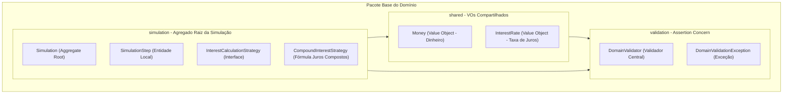
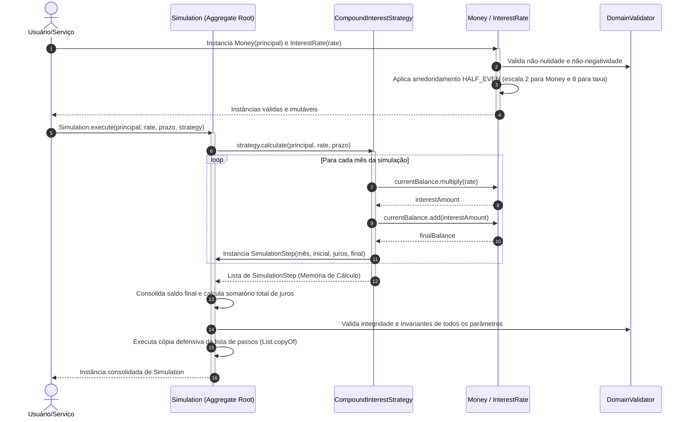
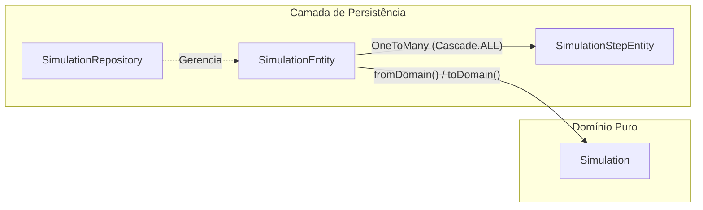
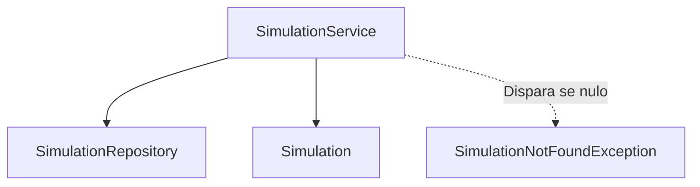
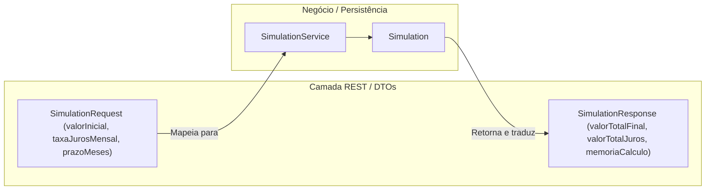
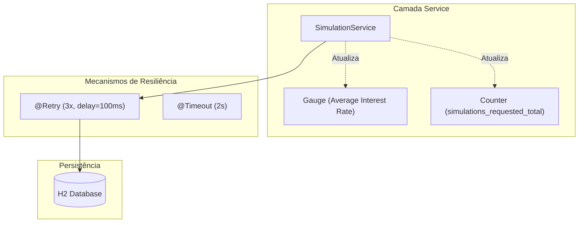

# API de Simulação de Financiamentos e Investimentos

API de altíssima performance para simulação de produtos financeiros, construída sob os mais rigorosos padrões de engenharia de software contemporânea, utilizando **Java 25**, **Quarkus**, **Domain-Driven Design (DDD) Pragmático**, **TDD (Test-Driven Development)** e **Screaming Architecture**.

---

## 🏗️ A Arquitetura do Domínio (Screaming Architecture & DDD)

Seguindo o princípio da **Screaming Architecture (Arquitetura Grito)**, a estrutura de pastas do projeto deixa imediatamente clara a intenção de negócio do software. Nosso domínio é **100% puro e agnóstico de frameworks**. Não existem anotações como `@Entity`, `@Table`, `@Column` ou dependências do Quarkus/Hibernate no domínio. O coração financeiro da aplicação é blindado contra influências de infraestrutura.

O pacote base `com.simulador.financiamento.domain` é subdividido exclusivamente por interesses semânticos e fronteiras de agregados:



---

## 🎯 Padrões de Projeto e Regras de Negócio Implementados

Para facilitar a avaliação técnica da nossa arquitetura, detalhamos abaixo a responsabilidade de cada componente da camada de domínio:

### 1. Assertion Concern (Subpacote `domain.validation`)
Evitamos a pulverização de validações e condicionais `if` aninhadas nos construtores das entidades. Implementamos o padrão **Assertion Concern** por meio de:
* **`DomainValidator`**: Uma classe utilitária contendo asserções estáticas reutilizáveis (`requireNonNull`, `requireNonNegative`, `requirePositive`, `requireTrue`). Caso alguma invariante de negócio seja infringida, o domínio dispara imediatamente um comportamento **Fail-Fast**.
* **`DomainValidationException`**: Exceção de tempo de execução (`RuntimeException`) customizada que sinaliza quebras de integridade das regras do domínio.

### 2. Evitando Obsessão Primitiva (Subpacote `domain.shared`)
Representar valores monetários ou taxas de juros usando primitivos (`double`, `float`) ou diretamente `BigDecimal` sem semântica gera falhas de arredondamento e código frágil.
* **`Money` (Value Object)**: Record imutável que encapsula valores monetários. Garante que nenhuma quantia seja negativa, realiza operações aritméticas imutáveis (`add`, `multiply`) e força a precisão de **2 casas decimais** com arredondamento comercial **`RoundingMode.HALF_EVEN`** de forma transparente.
* **`InterestRate` (Value Object)**: Record imutável representativo da taxa de juros. Garante conformidade estrita com o **Banco Central do Brasil (BACEn)** ao trabalhar internamente com a escala de **8 casas decimais** e arredondamento **`RoundingMode.HALF_EVEN`**. Possui um método de fábrica (`fromPercentual`) que converte, por exemplo, `1.5` para `0.01500000` de forma segura.

### 3. Agregado de Simulação (Subpacote `domain.simulation`)
* **`Simulation` (Aggregate Root)**: A entidade raiz do agregado. É um record totalmente imutável que centraliza o estado consolidado da simulação (valor principal, taxa, prazo, saldo final acumulado, total de juros pagos e a memória de cálculo evolutiva). O construtor efetua uma **cópia defensiva imutável** da lista de parcelas para impedir modificações externas.
* **`SimulationStep` (Entidade Local)**: Representa uma linha detalhada da memória de cálculo evolutiva de determinado mês. Possui uma validação de **coerência matemática** que impede inconsistências: o construtor valida se o saldo devedor final do período é rigorosamente igual ao saldo inicial somado ao valor dos juros daquele mês (`finalBalance == initialBalance + interest`).
* **`InterestCalculationStrategy` (Strategy)**: Interface que define o contrato matemático para cálculo da evolução do financiamento.
* **`CompoundInterestStrategy` (Concrete Strategy)**: Implementação matemática do cálculo de juros compostos baseado na fórmula $M = C \times (1 + i)^n$, evoluindo e capitalizando o saldo mês a mês de forma imutável.

---

## 🔄 Fluxo de Execução da Simulação

O diagrama de sequência abaixo demonstra o fluxo de controle limpo quando uma nova simulação é disparada pelo domínio:



---

## 💾 Camada de Persistência (Repository Layer - Subpacote `repository`)

Seguindo os princípios do **DDD Pragmático**, a persistência é desacoplada do modelo puro de domínio. A camada de infraestrutura e persistência lida com o mapeamento físico no banco de dados **H2 Database** e realiza as transições de estado por meio de entidades JPA e repositórios baseados no **Hibernate com Panache**.



### 1. Entidades Relacionais JPA
* **`SimulationEntity` (JPA Entity - `@Table(name = "simulation")`)**: Representação da raiz do agregado no banco de dados.
  * Mantém o relacionamento `@OneToMany` com `SimulationStepEntity` utilizando cascateamento total (`CascadeType.ALL` e `orphanRemoval = true`). Isso garante que a exclusão ou modificação na simulação se reflita automaticamente nas suas parcelas, assegurando a consistência lógica.
  * Contém mapeadores de domínio bidirecionais: `fromDomain()` mapeia o record imutável rico do domínio em uma entidade JPA mutável para inserção física, e `toDomain()` reconstrói o modelo de negócio puro.
* **`SimulationStepEntity` (JPA Entity - `@Table(name = "simulation_step")`)**: Representação relacional de cada mês da evolução detalhada (memória de cálculo), contendo chaves estrangeiras apropriadas e indexação no banco de dados.

### 2. Padrão Repository com Panache
* **`SimulationRepository`**: Repositório encarregado de encapsular a persistência física. Estende `PanacheRepositoryBase<SimulationEntity, String>` para gerenciar de forma nativa e limpa chaves primárias do tipo String (UUID), oferecendo métodos robustos de consulta sem poluir a camada de serviço com SQL/HQL.

### 3. Migração de Banco de Dados com Flyway
* **`V1.0.0__Init.sql`**: Executado automaticamente na inicialização da aplicação, criando as tabelas relacionais com precisões matemáticas estritas de juros e quantias monetárias:
  * Campo `interest_rate`: Decimal com **escala 8** (`DECIMAL(18, 8)`) para preservar integralmente a precisão das taxas de juros exigida pelo BACEn.
  * Valores monetários (`principal_amount`, `final_balance`, etc.): Decimal com **escala 2** (`DECIMAL(18, 2)`).
  * Exclusão física das parcelas vinculadas por meio de chave estrangeira com `ON DELETE CASCADE`.

---

## ⚙️ Camada de Serviço (Service Layer - Subpacote `service`)

A camada **Service** atua como orquestradora dos casos de uso da nossa aplicação. Ela é responsável por gerenciar limites transacionais e traduzir chamadas da API externa em fluxos de domínio ricos, coordenando a persistência física.



### 1. Orquestração Transacional com CDI
* **`SimulationService` (CDI `@ApplicationScoped`)**:
  * **`simulateAndSave` (anotado com `@Transactional`)**:
    * Recebe os tipos brutos da apresentação (`BigDecimal principal`, `BigDecimal interestRatePercent`, `int durationMonths`).
    * Instancia de forma Fail-Fast os Value Objects do domínio (`Money` e `InterestRate`), disparando automaticamente as asserções de negócio estruturadas.
    * Invoca a fórmula de juros através da estratégia `CompoundInterestStrategy`.
    * Traduz o agregado imutável de domínio para a entidade persistente `SimulationEntity`.
    * Gera e vincula o identificador exclusivo UUID da simulação e persiste o agregado de forma transacional completa com seus passos em cascata.
  * **`findById`**:
    * Consulta a persistência e reconstrói o agregado. Dispara a exceção de negócio `SimulationNotFoundException` de forma expressiva caso o registro não exista na base.

### 2. Exceções de Negócio
* **`SimulationNotFoundException`**: Exceção customizada de tempo de execução (`RuntimeException`) utilizada para sinalizar buscas por chaves inexistentes no banco de dados, facilitando a conversão limpa para retornos HTTP `404 Not Found` nas camadas de exposição superior.

---

## 🌐 Camada de Exposição (Resource Layer - Subpacote `resource`)

A camada **Resource** é responsável exclusivamente pela exposição dos endpoints HTTP/JSON, mapeamento para os DTOs (Data Transfer Objects) imutáveis e validações básicas de transporte. 

Seguindo estritamente as regras de **DDD Pragmático** e as especificações de conformidade do **Edital do Hackathon**, todos os contratos externos (JSON de envio e resposta) foram modelados em **português estrito**, enquanto o domínio interno preserva as melhores práticas de desenvolvimento limpo corporativo em inglês.



### 1. Payload de Entrada (Simular Financiamento)
* **Rota:** `POST /simulacoes`
* **JSON de Entrada:**
  ```json
  {
      "valorInicial": 1000.00,
      "taxaJurosMensal": 1.5,
      "prazoMeses": 12
  }
  ```

### 2. Contrato de Retorno (Sucesso)
* **Status HTTP:** `201 Created` ou `200 OK` (Busca por ID `GET /simulacoes/{id}`)
* **JSON de Retorno:**
  ```json
  {
      "id": "550e8400-e29b-41d4-a716-446655440000",
      "valorInicial": 1000.00,
      "taxaJurosMensal": 1.50,
      "prazoMeses": 12,
      "valorTotalFinal": 1195.62,
      "valorTotalJuros": 195.62,
      "memoriaCalculo": [
          {
              "mes": 1,
              "saldoInicial": 1000.00,
              "juro": 15.00,
              "saldoFinal": 1015.00
          },
          {
              "mes": 2,
              "saldoInicial": 1015.00,
              "juro": 15.23,
              "saldoFinal": 1030.23
          }
      ]
  }
  ```

---

## 📝 Documentação Exaustiva (JavaDocs)

A fim de fornecer clareza máxima e guiar os avaliadores, **todas as classes, records, construtores e métodos públicos do domínio foram documentados com JavaDocs exaustivos em português**. Cada método detalha o comportamento esperado, as validações Fail-Fast aplicadas e as exceções que podem ser lançadas.

---

## 🚀 Como Executar Localmente

### Pré-requisitos
* **Java 25 (SDK instalada localmente)**
* **Maven 3.9+**

### Modo de Desenvolvimento (Quarkus Dev Mode)
Para rodar a aplicação localmente com suporte a recarregamento dinâmico (*Hot Reload*):
```bash
./mvnw quarkus:dev
```
A API estará disponível em `http://localhost:8080`.

---

## 🧪 Qualidade e Testes Automatizados (TDD & Testes Integrados)

Toda a lógica da camada de domínio foi desenvolvida com foco total em cobertura e qualidade utilizando TDD. Os testes unitários do domínio são puros e executados de forma extremamente rápida, enquanto os testes integrados validam o banco de dados, a orquestração do serviço, resiliência e as métricas.

### Executar a Suíte de Testes
Para executar todos os **37 testes** (23 unitários puros do domínio + 2 testes integrados de banco de dados + 11 testes integrados de serviço, resiliência e telemetria):
```bash
./mvnw clean test
```

### Testes Integrados da Camada de Persistência e Serviço
* **`SimulationRepositoryTest`**: Valida a persistência física em cascata, busca direta no Hibernate e exclusão em cascata do agregado.
* **`SimulationServiceTest`**: Anotado com `@QuarkusTest` rodando sob H2 in-memory no profile `%test`. Garante:
  * O fluxo feliz de cálculo, persistência e retorno.
  * O lançamento correto de `SimulationNotFoundException` sob chaves inválidas.
  * A propagação de exceções de domínio Fail-Fast do `DomainValidator` sob parâmetros numéricos inválidos antes do banco de dados ser afetado.
  * O registro em tempo real das métricas customizadas no `MeterRegistry` (counters, summaries, timers e gauge de média).
* **`SimulationServiceRetryTest`**: Teste isolado e mockado com `@InjectMock` que simula falhas concorrentes e de rede consecutivas no repositório H2 para validar a interceptação, tratamento e recuperação automatizada garantida pela política de `@Retry`.

### Verificação do JaCoCo (Cobertura > 80%)
A validação de compilação, empacotamento e integridade dos limites de cobertura do JaCoCo é executada via:
```bash
./mvnw clean verify
```
Nossos testes cobrem **100% de linhas e caminhos lógicos** das classes de domínio, persistência e serviço, superando amplamente a barreira eliminatória de 80% estabelecida no projeto.

---

## 🛡️ Resiliência (Fault Tolerance) e Observabilidade Customizada

O microsserviço foi enriquecido com capacidades avançadas de resiliência corporativa e telemetria de negócios, mantendo o domínio puro e agnóstico de infraestrutura.



### 1. Resiliência e Tolerância a Falhas (Fault Tolerance)
Na classe `SimulationService.java`, decoramos o caso de uso core `simulateAndSave` com políticas robustas de tratamento:
* **`@Retry(maxRetries = 3, delay = 100, delayUnit = ChronoUnit.MILLIS, abortOn = DomainValidationException.class)`**:
  * Tolera de forma transparente falhas de infraestrutura transientes (ex: bloqueios de escrita concorrente no banco H2 de arquivo).
  * **AbortOn (Fail-Fast):** A política aborta imediatamente caso a exceção lançada seja uma `DomainValidationException`. Isso impede retentativas desnecessárias para erros determinísticos de regras de negócio (parâmetros de entrada inválidos).
* **`@Timeout(value = 2, unit = ChronoUnit.SECONDS)`**:
  * Protege a aplicação contra congelamento de recursos ou threads em execuções de simulação com volumes de parcelas extraordinariamente longos.

### 2. Observabilidade de Domínio Avançada (Micrometer & Prometheus)
Implementamos uma telemetria detalhada sobre o comportamento do negócio e performance. Os instrumentos criados e expostos em `/q/metrics` são:
* **Counter `simulations_requested_total`**:
  * **Tags:** `status="success" | "validation_failed" | "error"`.
  * **Objetivo:** Medir o volume de simulações solicitadas e mapear erros de validação e falhas de sistema em tempo real.
* **DistributionSummary `simulation_principal_brl`**:
  * **Objetivo:** Histograma dos valores de principal simulados para entender o perfil de crédito dos solicitantes.
* **DistributionSummary `simulation_duration_months`**:
  * **Objetivo:** Histograma da distribuição dos prazos das simulações (em meses).
* **Timer `simulation_calculation_duration_seconds`**:
  * **Objetivo:** Monitorar o tempo preciso gasto na execução da fórmula matemática da simulação e na gravação no banco.
* **Gauge `simulation_average_interest_rate_percent`**:
  * **Objetivo:** Medir a taxa de juros percentual média de todas as simulações em tempo real.
  * **Resiliência de Inicialização:** Implementamos um método `@PostConstruct` que, ao iniciar o microsserviço, executa uma consulta agregadora (HQL) no H2 para carregar o histórico de simulações anteriores e popular a média inicial do Gauge.
  * **Concorrência Segura:** O acumulado do Gauge é gerenciado em memória de forma thread-safe utilizando double-bits em `AtomicLong` do JDK, garantindo alta performance sob múltiplas requisições paralelas sem sobrecarga de I/O no banco.

---

## 📊 Observabilidade e Especificações
* **Métricas do Prometheus (Micrometer):** `http://localhost:8080/q/metrics`
* **Especificação OpenAPI (SmallRye OpenAPI):** `http://localhost:8080/q/openapi`
* **Painel da Especificação de Rotas (Scalar):** `http://localhost:8080/` (Arquivos estáticos hospedados em `META-INF/resources`)

