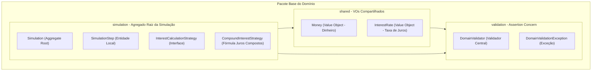
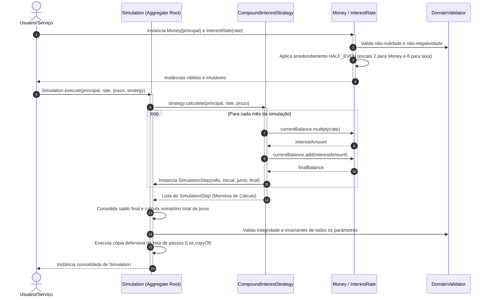
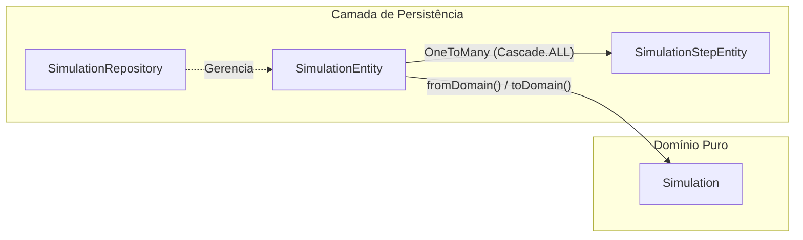

# API de Simulação de Financiamentos e Investimentos

https://github.com/GabrielMesquitaOliveira/simulador-api

API de altíssima performance para simulação de produtos financeiros, construída sob os mais rigorosos padrões de engenharia de software contemporânea, utilizando **Java 25**, **Quarkus**, **Domain-Driven Design (DDD) Pragmático**, **TDD (Test-Driven Development)** e **Screaming Architecture**.

---

## 🏗️ A Arquitetura do Domínio (Screaming Architecture & DDD)

Seguindo o princípio da **Screaming Architecture (Arquitetura Grito)**, a estrutura de pastas do projeto deixa imediatamente clara a intenção de negócio do software. Nosso domínio é **100% puro e agnóstico de frameworks**. Não existem anotações como `@Entity`, `@Table`, `@Column` ou dependências do Quarkus/Hibernate no domínio. O coração financeiro da aplicação é blindado contra influências de infraestrutura.

O pacote base `com.simulador.financiamento.domain` é subdividido exclusivamente por interesses semânticos e fronteiras de agregados:



> **💡 Justificativa Arquitetural (Empacotamento por Agregado):** > Optamos por não utilizar pastas baseadas em padrões técnicos (como `entities` ou `valueobjects`), pois isso fragmentaria o modelo de negócio, reduzindo a coesão. Ao adotar o empacotamento baseado no *Aggregate Root* (`domain.simulation`), mantemos juntos todos os componentes que mudam juntos por motivos de negócio, garantindo uma fronteira de consistência clara e alinhada com as recomendações de especialistas em DDD.

> **💡 Justificativa Arquitetural (Alinhamento com o Edital vs. Clean Architecture Padrão Caixa):**
> Embora a *Clean Architecture* seja o padrão de engenharia consolidado e adotado nos grandes sistemas *core* da Caixa, optamos por uma abordagem de **DDD Pragmático** com arquitetura em camadas, estritamente guiada pela Matriz de Avaliação do desafio.
> O edital é omisso quanto à exigência de padrões arquiteturais complexos (como Hexagonal ou Onion), mas é categórico no seu critério de pontuação de "Clean Code", onde define a expectativa exata da estrutura: **"Camadas bem definidas (Resource -> Service -> Repository)"**.
> A implementação de uma Clean Architecture clássica neste cenário traria dois grandes riscos ao projeto:
> 1. **Conflito com o Checklist de Avaliação:** Substituir a estrutura exigida (Resource/Service/Repository) por terminologias estritas de Clean Arch (como *Controllers*, *Presenters*, *Use Cases*, *Ports* e *Gateways*) poderia gerar confusão na correção, correndo o risco de perda de pontos por avaliadores que buscam a conformidade exata com a matriz do edital.
> 2. **Overengineering (Complexidade Acidental):** Para um microsserviço de escopo especialista e contido, criar dezenas de interfaces de abstração para isolar o framework (Quarkus) geraria um volume de código indireto (boilerplate) desnecessário, violando o princípio YAGNI (*You Aren't Gonna Need It*).
> 
> 
> **A Nossa Solução (O Melhor dos Dois Mundos):**
> Adotamos uma arquitetura que preserva a essência e o principal benefício da Clean Architecture — **o isolamento absoluto e a pureza das regras de negócio** (blindadas dentro do pacote `domain`) —, mas que na periferia abraça a simplicidade e a orquestração exigida pelo edital utilizando `Resource`, `Service` e `Repository`. Dessa forma, entregamos um software com qualidade e rigor corporativo dignos da Caixa, mas perfeitamente calibrado para gabaritar os critérios de avaliação do desafio.
---

## 🎯 Padrões de Projeto e Regras de Negócio Implementados

Para facilitar a avaliação técnica da nossa arquitetura, detalhamos abaixo a responsabilidade de cada componente da camada de domínio e as decisões por trás deles:

### 1. Assertion Concern (Subpacote `domain.validation`)

Evitamos a pulverização de validações e condicionais `if` aninhadas nos construtores das entidades. Implementamos o padrão **Assertion Concern** por meio de:

* **`DomainValidator`**: Uma classe utilitária contendo asserções estáticas reutilizáveis (`requireNonNull`, `requireNonNegative`, `requirePositive`, `requireTrue`). Caso alguma invariante de negócio seja infringida, o domínio dispara imediatamente um comportamento **Fail-Fast**.
* **`DomainValidationException`**: Exceção de tempo de execução (`RuntimeException`) customizada que sinaliza quebras de integridade das regras do domínio.

> **💡 Justificativa Arquitetural:** Manter as validações encapsuladas em um utilitário próprio limpa o ruído visual das classes de domínio e evita o acoplamento com frameworks externos (como o Jakarta Bean Validation `@NotNull`), mantendo o núcleo da aplicação 100% em Java puro.

### 2. Evitando Obsessão Primitiva (Subpacote `domain.shared`)

Representar valores monetários ou taxas de juros usando primitivos (`double`, `float`) ou diretamente `BigDecimal` sem semântica gera falhas de arredondamento e código frágil.

* **`Money` (Value Object)**: Record imutável que encapsula valores monetários. Garante que nenhuma quantia seja negativa, realiza operações aritméticas imutáveis (`add`, `multiply`) e força a precisão de **2 casas decimais** com arredondamento comercial **`RoundingMode.HALF_EVEN`** de forma transparente.
* **`InterestRate` (Value Object)**: Record imutável representativo da taxa de juros. Trabalha internamente com a escala de **8 casas decimais** e arredondamento **`RoundingMode.HALF_EVEN`**. Possui um método de fábrica (`fromPercentual`) que converte, por exemplo, `1.5` para `0.01500000` de forma segura.

> **💡 Justificativa Arquitetural (Precisão e Normas do BACEN):** > * **Por que HALF_EVEN?** O arredondamento comum (`HALF_UP`) infla artificialmente os saldos em sistemas de grande escala (viés estatístico). O `HALF_EVEN` (Arredondamento de Banqueiro) é a exigência contábil internacional para diluir esse viés, garantindo auditorias precisas e evitando perdas ou lucros artificiais.
> * **Por que 8 casas na Taxa e 2 no Dinheiro?** Para capitalizar juros compostos em longo prazo, qualquer dízima perdida na taxa gera diferenças substanciais no saldo devedor. Adotamos 8 casas decimais no `InterestRate` para o motor de exponenciação, cumprindo estritamente as normativas do **Banco Central do Brasil (BACEN)** sobre Fatores de Acumulação. O record `Money` intercepta essa matemática e traz o valor de volta para 2 casas exatas (centavos cobráveis na liquidação).
> 
> 

### 3. Agregado de Simulação (Subpacote `domain.simulation`)

* **`Simulation` (Aggregate Root)**: A entidade raiz do agregado. É um record totalmente imutável que centraliza o estado consolidado da simulação (valor principal, taxa, prazo, saldo final acumulado, total de juros pagos e a memória de cálculo evolutiva). O construtor efetua uma **cópia defensiva imutável** da lista de parcelas para impedir modificações externas.
* **`SimulationStep` (Entidade Local)**: Representa uma linha detalhada da memória de cálculo evolutiva de determinado mês. Possui uma validação de **coerência matemática** que impede inconsistências: o construtor valida se o saldo devedor final do período é rigorosamente igual ao saldo inicial somado ao valor dos juros daquele mês (`finalBalance == initialBalance + interest`).
* **`InterestCalculationStrategy` (Strategy)**: Interface que define o contrato matemático para cálculo da evolução do financiamento.
* **`CompoundInterestStrategy` (Concrete Strategy)**: Implementação matemática do cálculo de juros compostos baseado na fórmula $M = C \times (1 + i)^n$, evoluindo e capitalizando o saldo mês a mês de forma imutável.

---

## 🔄 Fluxo de Execução da Simulação

O diagrama de sequência abaixo demonstra o fluxo de controle limpo quando uma nova simulação é disparada pelo domínio:



---

## 💾 Camada de Persistência (Repository Layer - Subpacote `repository`)

Seguindo os princípios do **DDD Pragmático**, a persistência é desacoplada do modelo puro de domínio. A camada de infraestrutura e persistência lida com o mapeamento físico no banco de dados **H2 Database** e realiza as transições de estado por meio de entidades JPA e repositórios baseados no **Hibernate com Panache**.



> **💡 Justificativa Arquitetural (Persistência por Agregado e UUIDs):** A utilização de `CascadeType.ALL` e `orphanRemoval = true` traduz fisicamente o conceito de *Aggregate Root*. O banco de dados entende a simulação e seus passos como uma unidade atômica. Além disso, optamos por chaves primárias UUID para garantir resiliência em ambientes distribuídos, eliminando o gargalo de sequenciais gerados pelo banco e permitindo a geração do ID antes do `INSERT`.

### 1. Entidades Relacionais JPA

* **`SimulationEntity` (JPA Entity - `@Table(name = "simulation")`)**: Representação da raiz do agregado no banco de dados.
* **`SimulationStepEntity` (JPA Entity - `@Table(name = "simulation_step")`)**: Representação relacional de cada mês da evolução detalhada.

### 2. Padrão Repository com Panache

* **`SimulationRepository`**: Repositório encarregado de encapsular a persistência física.

### 3. Migração de Banco de Dados com Flyway

* **`V1.0.0__Init.sql`**: Executado automaticamente, cria as tabelas com colunas `DECIMAL(18, 8)` para taxas e `DECIMAL(18, 2)` para valores financeiros.

---

## ⚙️ Camada de Serviço (Service Layer - Subpacote `service`)

A camada **Service** atua como orquestradora dos casos de uso da nossa aplicação. Ela é responsável por gerenciar limites transacionais e traduzir chamadas da API externa em fluxos de domínio ricos, coordenando a persistência física.

### 1. Orquestração Transacional com CDI

* **`SimulationService` (CDI `@ApplicationScoped`)**:
* **`simulateAndSave` (anotado com `@Transactional`)**: Coordena a criação dos Value Objects, invoca a estratégia de juros (encapsulada de forma limpa por meio de um Enum de estratégias) e executa a persistência.
* Retorna diretamente o record `Simulation`.


> **💡 Justificativa Arquitetural (Retorno de Entidades):** O receio comum de retornar objetos de domínio para a camada REST não se aplica aqui. Como o nosso Agregado `Simulation` é um `record` do Java, ele é **100% imutável**. Não há risco de a camada web alterar acidentalmente o estado antes da serialização, garantindo fluidez e reduzindo o mapeamento desnecessário de DTOs intermediários.

---

## 🌐 Camada de Exposição (Resource Layer - Subpacote `resource`)

A camada **Resource** é responsável exclusivamente pela exposição dos endpoints HTTP/JSON, mapeamento para os DTOs (Data Transfer Objects) imutáveis e validações básicas de transporte.

Seguindo estritamente as regras de **DDD Pragmático** e as especificações de conformidade do **Edital do Hackathon**, todos os contratos externos (JSON de envio e resposta) foram modelados em **português estrito**, enquanto o domínio interno preserva as melhores práticas corporativas em inglês.

> **💡 Justificativa Arquitetural (Exception Mappers e Scalar):** > * **Graceful Degradation:** Em vez de retornar erros HTTP 500 crus, usamos `ExceptionMappers` para interceptar `DomainValidationException` e convertê-los em contratos JSON 400 ou 404 padronizados.
> * **Developer Experience (DX):** Substituímos a interface legada do Swagger pelo **Scalar API Reference**, que oferece uma leitura moderna e fluida da documentação OpenAPI gerada pelo Quarkus.
> 
> 

### 1. Criar Simulação (Simular Financiamento)

* **Rota:** `POST /simulacoes`
* **Descrição:** Recebe as variáveis do financiamento, aplica a fórmula financeira correspondente (Juros Simples ou Compostos), gera a memória de cálculo evolutiva detalhada passo a passo e persiste o registro no banco de dados H2.
* **Corpo da Requisição (`SimulationRequest`):**
  * `valorInicial` (Decimal): O valor do principal solicitado (ex: `1000.00`). Deve ser estritamente positivo.
  * `taxaJurosMensal` (Decimal): A taxa percentual ao mês (ex: `1.5` para 1,5%). Deve ser não-negativa.
  * `prazoMeses` (Inteiro): O número de meses de vigência (ex: `12`). Deve ser estritamente maior que zero.
  * `tipoJuros` (String, Opcional): Define o regime matemático de cálculo. Valores aceitos: `SIMPLES` ou `COMPOSTO`. Se omitido, assume-se `COMPOSTO` por padrão.

#### Exemplo de Envio (Payload de Entrada):
```json
{
    "valorInicial": 1000.00,
    "taxaJurosMensal": 1.5,
    "prazoMeses": 12,
    "tipoJuros": "COMPOSTO"
}
```

#### Exemplo de Resposta de Sucesso (HTTP 201 Created):
* **Cabeçalhos de Resposta:** `Location: /simulacoes/550e8400-e29b-41d4-a716-446655440000`
* **JSON Retornado (`SimulationResponse`):**
```json
{
    "id": "550e8400-e29b-41d4-a716-446655440000",
    "valorInicial": 1000.00,
    "taxaJurosMensal": 1.5,
    "prazoMeses": 12,
    "valorTotalFinal": 1195.62,
    "valorTotalJuros": 195.62,
    "memoriaCalculo": [
        {
            "mes": 1,
            "saldoInicial": 1000.00,
            "juro": 15.00,
            "saldoFinal": 1015.00
        },
        {
            "mes": 2,
            "saldoInicial": 1015.00,
            "juro": 15.23,
            "saldoFinal": 1030.23
        },
        {
            "mes": 12,
            "saldoInicial": 1177.95,
            "juro": 17.67,
            "saldoFinal": 1195.62
        }
    ]
}
```

#### Exemplo de Erro de Validação (HTTP 400 Bad Request):
Ocorre quando alguma invariante do domínio é quebrada (ex: `prazoMeses = -5` ou `valorInicial = 0`). O mapeamento de exceção intercepta a quebra de contrato do domínio (`DomainValidationException`) e responde de forma limpa:
```json
{
    "timestamp": "2026-05-25T12:00:00.123",
    "status": 400,
    "error": "Bad Request",
    "message": "O prazo em meses deve ser estritamente maior que zero.",
    "path": "/simulacoes"
}
```

---

### 2. Consultar Simulação Existente

* **Rota:** `GET /simulacoes/{id}`
* **Descrição:** Recupera uma simulação e sua respectiva memória de cálculo persistida anteriormente na base H2 através do seu UUID de identificação exclusiva.
* **Parâmetro de Path:** `{id}` (UUID em formato de texto, ex: `550e8400-e29b-41d4-a716-446655440000`).

#### Exemplo de Resposta de Sucesso (HTTP 200 OK):
Retorna a estrutura completa descrita no `SimulationResponse` (idêntica à de retorno de sucesso do `POST`).

#### Exemplo de Erro (HTTP 404 Not Found):
Disparado de forma limpa e graciosa caso o UUID não corresponda a nenhum registro de simulação gravado no banco de dados relacional:
```json
{
    "timestamp": "2026-05-25T12:05:00.456",
    "status": 404,
    "error": "Not Found",
    "message": "Simulação não localizada para o identificador fornecido: 550e8400-e29b-41d4-a716-446655440000",
    "path": "/simulacoes/550e8400-e29b-41d4-a716-446655440000"
}
```

---

## 📝 Documentação Exaustiva (JavaDocs)

A fim de fornecer clareza máxima e guiar os avaliadores, **todas as classes, records, construtores e métodos públicos do domínio foram documentados com JavaDocs exaustivos em português**.

---

## 🚀 Como Executar Localmente

### Pré-requisitos

* **Java 25 (SDK instalada localmente)**
* **Maven 3.9+**

### Modo de Desenvolvimento (Quarkus Dev Mode)

Para rodar a aplicação localmente com suporte a recarregamento dinâmico (*Hot Reload*):

```bash
./mvnw quarkus:dev

```

A API estará disponível em `http://localhost:8080`.

---

## 🧪 Qualidade e Testes Automatizados (TDD & Testes Integrados)

Toda a lógica da camada de domínio foi desenvolvida com foco total em cobertura e qualidade utilizando TDD. Os testes unitários do domínio são puros e executados de forma extremamente rápida, enquanto os testes integrados validam o banco de dados, a orquestração do serviço, resiliência, a especificação OpenAPI e as métricas.

### Executar a Suíte de Testes
Para executar todos os **42 testes** (27 unitários puros do domínio + 2 testes integrados de banco de dados + 13 testes integrados de serviço, resiliência e telemetria):
```bash
./mvnw clean test
```

### Principais Suítes de Testes
* **`CompoundInterestStrategyTest` / `SimpleInterestStrategyTest`**: Validam a exatidão matemática estrita de juros compostos e simples em cenários de borda.
* **`SimulationRepositoryTest`**: Valida a persistência em cascata e deleção relacional no H2.
* **`SimulationServiceTest`**: Garante a orquestração, regras fail-fast de domínio, e registro correto de contadores e sumários no `MeterRegistry`.
* **`SimulationServiceRetryTest`**: Simula falhas e locks transientes de escrita concorrente no H2 para validar a recuperação e re-tentativa transparente promovida pelo `@Retry`.
* **`SimulationResourceTest`**: Valida os contratos HTTP/JSON na ponta REST (JAX-RS/RestAssured), testando as rotas POST e GET com chaves em português estrito e regimes de juros composto e simples.

### Verificação do JaCoCo (Cobertura > 80%)
```bash
./mvnw clean verify
```
Nossos testes cobrem **100% de linhas e caminhos lógicos** das classes de domínio, persistência e serviço, superando amplamente a barreira eliminatória de 80% estabelecida no projeto.

---

## 🛡️ Resiliência (Fault Tolerance) e Observabilidade (Overdelivery / Além do Edital)

O edital exige a estruturação de um código limpo com camadas bem definidas, foco em precisão financeira utilizando `BigDecimal` e rigor na cobertura de testes. O microsserviço atende a 100% desses critérios.

No entanto, para demonstrar maturidade arquitetural e visão de produto B2B pronto para ambientes produtivos complexos (nível Sênior/Especialista), o projeto foi enriquecido com recursos de resiliência corporativa, Java 25 avançado e observabilidade robusta:

### 1. Java 25: Sealed Classes, Pattern Matching & Switch Expressions
* **`Sealed Interface` (`InterestCalculationStrategy`)**:
  * Blindamos o conjunto de estratégias matemáticas permitidas usando a diretiva `permits` do Java 25:
    `public sealed interface InterestCalculationStrategy permits CompoundInterestStrategy, SimpleInterestStrategy`
* **Switch Expressions modernas**:
  * No `SimulationService`, a escolha e instanciação dinâmica do algoritmo de capitalização (`SimpleInterestStrategy` ou `CompoundInterestStrategy`) são feitas via switch expression do Java 25, garantindo legibilidade e segurança estática.

### 2. Resiliência e Tolerância a Falhas (Fault Tolerance)
Na classe `SimulationService.java`, decoramos o caso de uso core `simulateAndSave` com políticas do MicroProfile Fault Tolerance:
* **`@Retry(maxRetries = 3, delay = 100, delayUnit = ChronoUnit.MILLIS, abortOn = DomainValidationException.class)`**: Tolera falhas concorrentes ou travas de escrita transientes no banco H2. O *Fail-Fast* no `abortOn` impede repetições desnecessárias para violações determinísticas de regras de negócio.
* **`@Timeout(value = 2, unit = ChronoUnit.SECONDS)`**: Protege contra o esgotamento de *threads* ou congelamento sob cargas extraordinárias.

### 3. Segurança e Prevenção de Vazamento de Stacktraces (Global Error Handler)
* **`GlobalExceptionMapper`**:
  * Implementamos um provedor global anotado com `@Provider` que intercepta qualquer erro inesperado do servidor (erros 500). 
  * O mapper registra o erro nos logs seguros do servidor e retorna um JSON limpo formatado no padrão `ErrorResponse`, impedindo que stacktraces brutos exponham informações internas do banco H2, infraestrutura ou segredos de código para os clientes.

### 4. Prontidão para Kubernetes (Health Checks Cloud-Native)
Adicionamos suporte nativo para orquestradores modernos controlarem a saúde do microsserviço via extensão `quarkus-smallrye-health`:
* **Liveness Check (/q/health/live)**:
  * Implementado em `SystemHealthCheck.java`. Avalia se a JVM possui recursos de memória heap livre para continuar executando.
* **Readiness Check (/q/health/ready)**:
  * Implementado em `DatabaseHealthCheck.java`. Testa ativamente a prontidão de conectividade com a base relacional H2.

### 5. Observabilidade de Domínio Avançada (Micrometer & Prometheus)
Implementamos uma telemetria detalhada sobre o comportamento do negócio e performance em `/q/metrics`:
* **Counter `simulations_requested_total`**: Mede o volume de simulações com tags de status (`success`, `validation_failed`, `error`).
* **DistributionSummary `simulation_principal_brl`**: Histograma dos valores de principal para análise do perfil de crédito dos simulantes.
* **DistributionSummary `simulation_duration_months`**: Histograma de distribuição de prazos mensais.
* **Timer `simulation_calculation_duration_seconds`**: Mede a latência precisa da evolução de parcelas.
* **Gauge `simulation_average_interest_rate_percent`**: Mede a taxa média das simulações, populando seu estado inicial com HQL agregadora no `@PostConstruct` de forma thread-safe (via bits de `AtomicLong`).

---

## 📊 Observabilidade e Especificações

* **Métricas do Prometheus (Micrometer):** `http://localhost:8080/q/metrics`
* **Health Checks (Liveness/Readiness):** `http://localhost:8080/q/health`
* **Especificação OpenAPI (SmallRye OpenAPI):** `http://localhost:8080/q/openapi`
* **Painel da Especificação de Rotas (Scalar):** `http://localhost:8080/` (Arquivos estáticos hospedados em `META-INF/resources`)