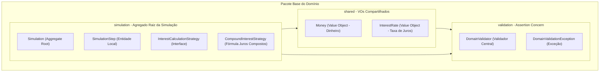
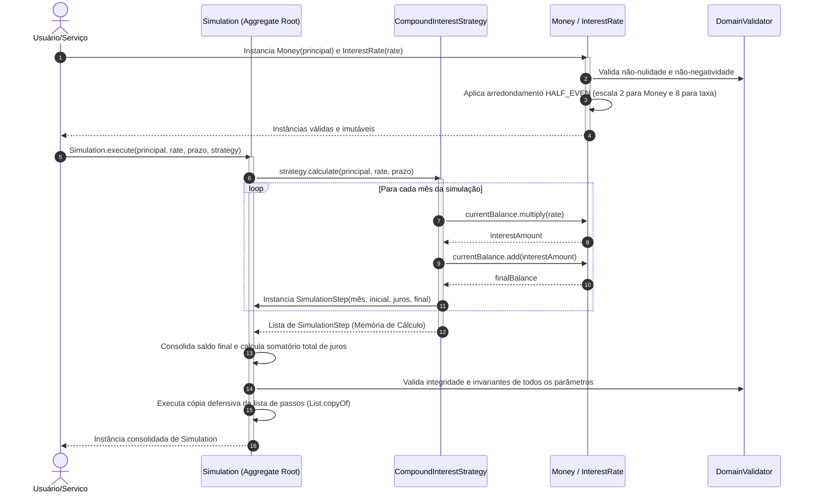

# API de Simulação de Financiamentos e Investimentos

API de altíssima performance para simulação de produtos financeiros, construída sob os mais rigorosos padrões de engenharia de software contemporânea, utilizando **Java 25**, **Quarkus**, **Domain-Driven Design (DDD) Pragmático**, **TDD (Test-Driven Development)** e **Screaming Architecture**.

---

## 🏗️ A Arquitetura do Domínio (Screaming Architecture & DDD)

Seguindo o princípio da **Screaming Architecture (Arquitetura Grito)**, a estrutura de pastas do projeto deixa imediatamente clara a intenção de negócio do software. Nosso domínio é **100% puro e agnóstico de frameworks**. Não existem anotações como `@Entity`, `@Table`, `@Column` ou dependências do Quarkus/Hibernate no domínio. O coração financeiro da aplicação é blindado contra influências de infraestrutura.

O pacote base `com.simulador.financiamento.domain` é subdividido exclusivamente por interesses semânticos e fronteiras de agregados:



---

## 🎯 Padrões de Projeto e Regras de Negócio Implementados

Para facilitar a avaliação técnica da nossa arquitetura, detalhamos abaixo a responsabilidade de cada componente da camada de domínio:

### 1. Assertion Concern (Subpacote `domain.validation`)
Evitamos a pulverização de validações e condicionais `if` aninhadas nos construtores das entidades. Implementamos o padrão **Assertion Concern** por meio de:
* **`DomainValidator`**: Uma classe utilitária contendo asserções estáticas reutilizáveis (`requireNonNull`, `requireNonNegative`, `requirePositive`, `requireTrue`). Caso alguma invariante de negócio seja infringida, o domínio dispara imediatamente um comportamento **Fail-Fast**.
* **`DomainValidationException`**: Exceção de tempo de execução (`RuntimeException`) customizada que sinaliza quebras de integridade das regras do domínio.

### 2. Evitando Obsessão Primitiva (Subpacote `domain.shared`)
Representar valores monetários ou taxas de juros usando primitivos (`double`, `float`) ou diretamente `BigDecimal` sem semântica gera falhas de arredondamento e código frágil.
* **`Money` (Value Object)**: Record imutável que encapsula valores monetários. Garante que nenhuma quantia seja negativa, realiza operações aritméticas imutáveis (`add`, `multiply`) e força a precisão de **2 casas decimais** com arredondamento comercial **`RoundingMode.HALF_EVEN`** de forma transparente.
* **`InterestRate` (Value Object)**: Record imutável representativo da taxa de juros. Garante conformidade estrita com o **Banco Central do Brasil (BACEn)** ao trabalhar internamente com a escala de **8 casas decimais** e arredondamento **`RoundingMode.HALF_EVEN`**. Possui um método de fábrica (`fromPercentual`) que converte, por exemplo, `1.5` para `0.01500000` de forma segura.

### 3. Agregado de Simulação (Subpacote `domain.simulation`)
* **`Simulation` (Aggregate Root)**: A entidade raiz do agregado. É um record totalmente imutável que centraliza o estado consolidado da simulação (valor principal, taxa, prazo, saldo final acumulado, total de juros pagos e a memória de cálculo evolutiva). O construtor efetua uma **cópia defensiva imutável** da lista de parcelas para impedir modificações externas.
* **`SimulationStep` (Entidade Local)**: Representa uma linha detalhada da memória de cálculo evolutiva de determinado mês. Possui uma validação de **coerência matemática** que impede inconsistências: o construtor valida se o saldo devedor final do período é rigorosamente igual ao saldo inicial somado ao valor dos juros daquele mês (`finalBalance == initialBalance + interest`).
* **`InterestCalculationStrategy` (Strategy)**: Interface que define o contrato matemático para cálculo da evolução do financiamento.
* **`CompoundInterestStrategy` (Concrete Strategy)**: Implementação matemática do cálculo de juros compostos baseado na fórmula $M = C \times (1 + i)^n$, evoluindo e capitalizando o saldo mês a mês de forma imutável.

---

## 🔄 Fluxo de Execução da Simulação

O diagrama de sequência abaixo demonstra o fluxo de controle limpo quando uma nova simulação é disparada pelo domínio:



---

## 📝 Documentação Exaustiva (JavaDocs)

A fim de fornecer clareza máxima e guiar os avaliadores, **todas as classes, records, construtores e métodos públicos do domínio foram documentados com JavaDocs exaustivos em português**. Cada método detalha o comportamento esperado, as validações Fail-Fast aplicadas e as exceções que podem ser lançadas.

---

## 🚀 Como Executar Localmente

### Pré-requisitos
* **Java 25 (SDK instalada localmente)**
* **Maven 3.9+**

### Modo de Desenvolvimento (Quarkus Dev Mode)
Para rodar a aplicação localmente com suporte a recarregamento dinâmico (*Hot Reload*):
```bash
./mvnw quarkus:dev
```
A API estará disponível em `http://localhost:8080`.

---

## 🧪 Qualidade e Testes Automatizados (TDD)

Toda a lógica da camada de domínio foi desenvolvida com foco total em cobertura e qualidade, sem acoplar contextos pesados do Quarkus no domínio.

### Executar a Suíte de Testes
Para executar todos os 23 testes unitários puros:
```bash
./mvnw clean test
```

### Verificação do JaCoCo (Cobertura > 80%)
A validação de compilação, empacotamento e integridade dos limites de cobertura do JaCoCo é executada via:
```bash
./mvnw clean verify
```
Nossos testes unitários cobrem **100% de linhas e caminhos lógicos** das classes de domínio, superando amplamente a barreira eliminatória de 80% do projeto.

---

## 📊 Observabilidade e Especificações
* **Métricas Locais (Micrometer/Prometheus):** `http://localhost:8080/q/metrics`
* **Especificação OpenAPI (SmallRye OpenAPI):** `http://localhost:8080/q/openapi`
